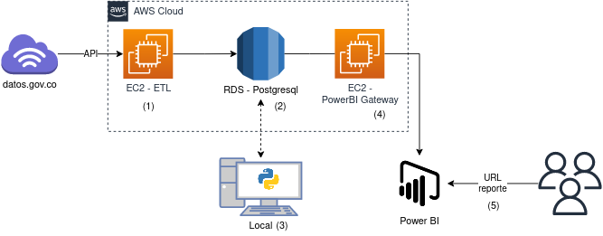

# Proyecto actualización automática de los datos de COVID en Colombia
[Enlace al reporte en linea](https://app.powerbi.com/view?r=eyJrIjoiZmUxZDQ2YzYtNjE0NC00YWFhLWI3ODAtMWI1ZDUzNzE4NDUzIiwidCI6IjUwNjQwNTg0LTJhNDAtNDIxNi1hODRiLTliM2VlMGYzZjZjZiIsImMiOjR9)

## _El proposito_

Este proyecto nace con la idea de aplicar conocimientos en uso de infrastructura cloud,
algo de procesos ETL hacia una base de datos y finalmente visualizar datos por medio de alguna herramienta de Business Intelligence.

## _¿De qué va esto?_

A propósito de la coyuntura actual (pandemia por COVID19) decidí crear un dashboard que de manera automática
se actualizara con los datos del Instituto Nacional de Salud de Colombia (INS), tomando los datos diarios de 
reportes de nuevos casos de COVID19, estos datos pueden ser consultados por medio de este [enlace](https://www.datos.gov.co/Salud-y-Protecci-n-Social/Casos-positivos-de-COVID-19-en-Colombia/gt2j-8ykr).

El presente proyecto hace cargues diarios a una base de datos PostgreSQL para posteriormente se consumidos desde Power BI
o para relizar algun análisis más profundo usando Jupyter Notebooks

## _Tecnología utilizada_

- EC2 de AWS
- Lambda Funcions de AWS
- S3 de AWS
- RDS de AWS
- Microsoft Power BI
- PostgreSQL
- Python y SQL como lenguajes

Esta tecnología anteriormente mencionada se ve representada en la siguiente arquitectura desplegada:

[]

- (0) Existen dos funciones lambda que prenden y apagan las instancias utilizadas para aminorar el consumo, adicionalmente en paralelo una función lambda guarda archivos .json independientes para cada uno de los días en un bucket de S3, por si en algun momento es necesario restaurar la información.
- (1) Instancia EC2 t2.micro (Hace parte del trial gratis) que corre en Amazon Linux y se encarga del proceso de ETL. Allí se encuentra el script [etl_bd.py](etl_bd.py) que se ejecuta diariamente a las 6:oo UTC programado con un cron (0 6 * * * ). Se llama el API de la fuente de datos con los filtros requeridos de fecha, se ajusta a una forma estructurada y se envía a la base de datos
- (2) Instancia RDS db.t2.micro (Hace parte del trial gratis) con motor Postgresql que tiene la tabla creada a partir de el script [query_tabla.sql](query_tabla.sql)
- (3) Se abren algunos caminos para poder acceder a la base de datos desde IPs específicas y poder aplicar analítica para proyectos que lo requieran mas adelante
- (4) Instancia EC2 t2.micro (Hace parte del trial gratis) que corre en Windows Server 2019 y aloja sencillamente el On-premise Power BI gateway para poder conectar a la base de datos y generar actualizaciones automáticas de los datos del reporte.
- (5) Se expone a través del servicio de publicación online de reportes de Power BI, la [url](https://app.powerbi.com/view?r=eyJrIjoiZmUxZDQ2YzYtNjE0NC00YWFhLWI3ODAtMWI1ZDUzNzE4NDUzIiwidCI6IjUwNjQwNTg0LTJhNDAtNDIxNi1hODRiLTliM2VlMGYzZjZjZiIsImMiOjR9) que permite a los usuarios consumir el reporte creado.

## _Futuros pasos_

Ya teniendo este proceso automático y recurrente, planeo hacer algunos análisis descriptivos que se alimenten de la información capturada y otras fuentes que puedan enrriquecer el análisis
